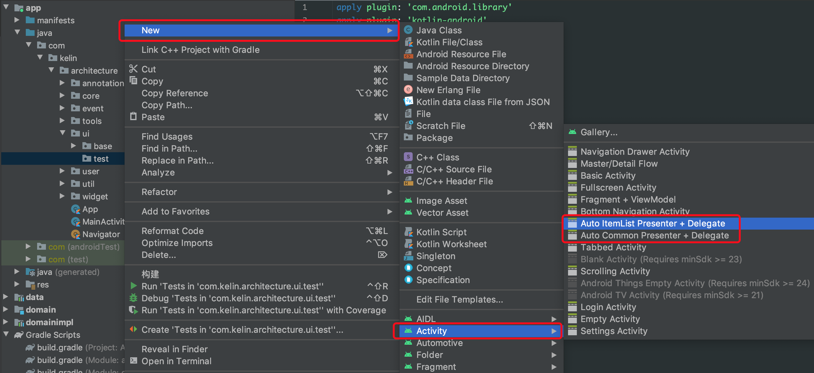
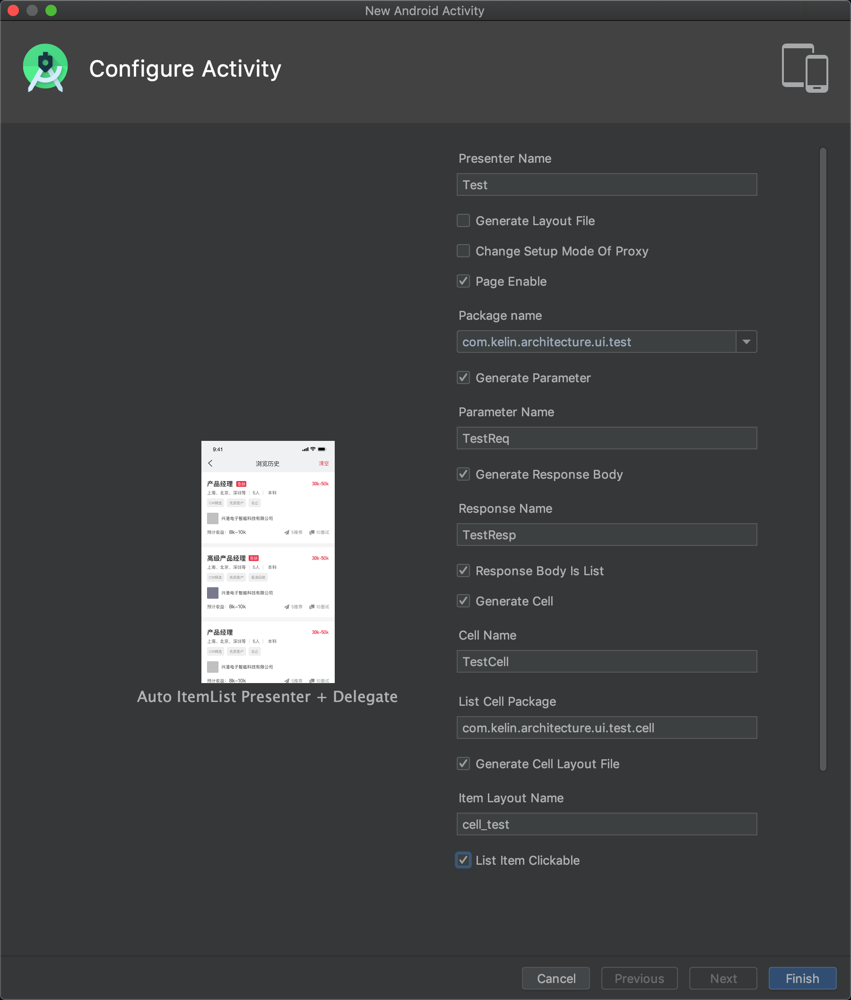
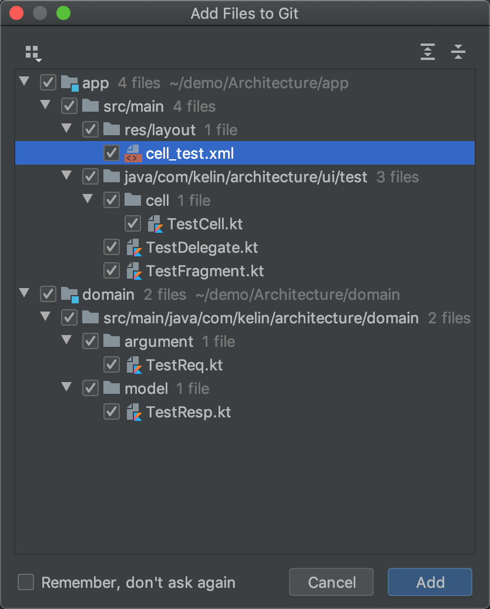
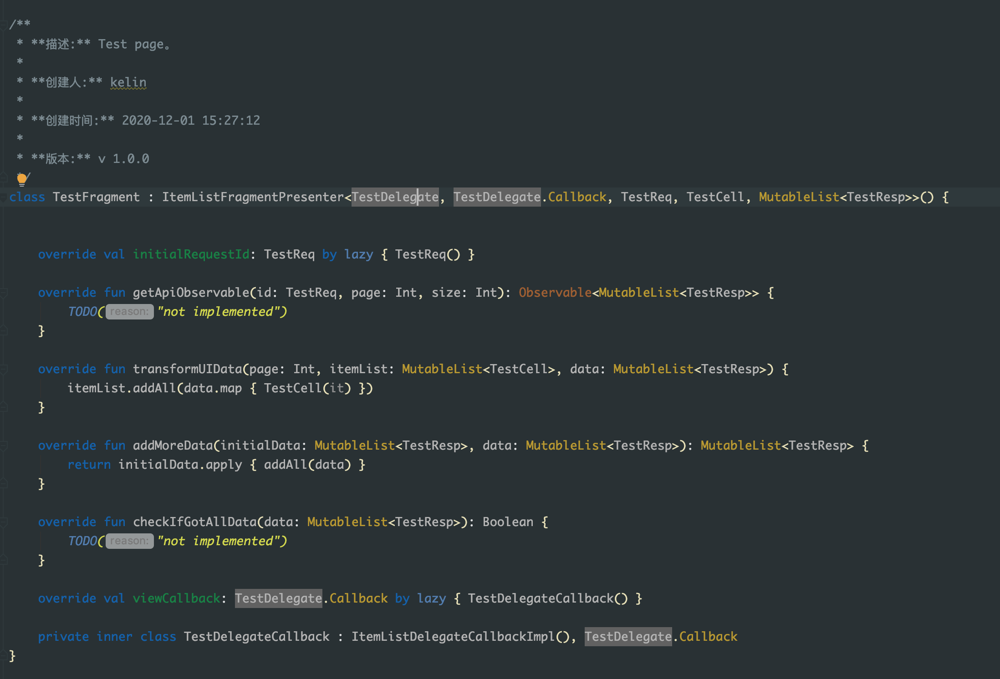

# Architecture
Android端MVP架构
## 简介
### 项目主要module介绍。
  * app 应用层，依赖于domain以及domainimpl。
    该层主要包含了MVP中的V和P，应用中的UI页面都应该是Fragment，而Activity应该是越少越好。没创建一个新的页面都会有比不可少的两个类，一个是V一个是P。
    * V即View 所有的V都继实现了ViewDelegate接口。
    * P即Presenter 所有的P都实现了ViewPresenter接口

  * domain 解耦层，该层为纯Java层，不依赖任何module。
  
  * domainimpl 解耦层接口的具体实现，依赖于data和domain。
    原则上该module只能处理domain中所定义的所有接口，不能有其他的业务逻辑。
  
  * data 数据层，依赖于domain。
    数据层其实只有一个功能，那就是提供数据。至于是从网络获取还是从本地缓存获取全部就数据层自己决策。

### 代码模板介绍
  项目中提供了两个文件夹，分别为```CommonFragment(带网络请求的普通页面)```和```ItemListFragment(带网络请求的列表页面)```。你需要将这两个文件夹拷贝到AS的包内，下面是macOS中的操作步骤：
  ```
  打开Finder -> 选择应用程序 -> 找到AndroidStudio并右键 -> 选择显示包内容 -> 点开路径⁨Contents⁩ ▸ ⁨plugins⁩ ▸ ⁨android⁩ ▸ ⁨lib⁩ ▸ ⁨templates⁩ ▸ ⁨activities⁩ -> 将架构中提供的两个文件夹粘贴到这里
  ```
  只用方式如下：
  
  
  
  
  
  
  